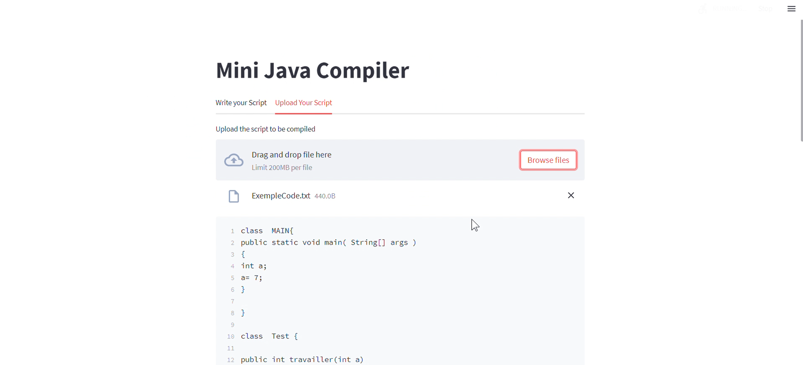

# MiniJavaCompiler
This is a mini collaborative project where we build a mini java compiler with C , Yacc/Bison and Lex.

# 
To start the project , all you have to do is run the following command :
``` Shell
python -m streamlit run Interface.py 
```

### Project Structure
``` code
    .
    ├── ExempleCode.txt                  # Java code containing a semantic error
    ├── ExempleJava.txt                  # Correct java code
    ├── Compiler_Files                   # files used to create the compiler
    │   ├── Compilateur.exe              # the created compiler 
    │   ├── Lexical.lex                  # lex file containing the lexical rules  
    │   ├── Syntaxique.y                 # YACC/Bison file containing the syntax rules 
    |   ├── GenCode.c                    # C file used to generate the machine code
    │   └── Semantique.c                 # C file containing the semantic rules 
    ├── Interface.py                     # used to create the interface 
    └── utils.py                         # contains a set of functions used in 
                                         # the Interface.py file

```
* `Lexical.lex` :  is used to generate a lexical analyzer or a lexer, which is responsible for breaking down the input source code into smaller pieces called tokens. These tokens are then passed on to the next stage of the compiler for further processing. The lexer performs operations such as skipping whitespace and comments, identifying keywords, identifiers, operators, and literals, and generating a token stream.
* `Syntaxique.y` : is used to generate a parser, which is responsible for checking the syntax of the input source code and building an abstract syntax tree (AST). The parser reads the token stream generated by the lexer and checks whether it conforms to the syntax rules specified in the file. If the input code is syntactically correct, the parser generates an AST, which is a hierarchical representation of the program's structure.
* `Semantique.c` :  is used to generate a semantic analyzer, which is responsible for checking the meaning or semantics of the input program. The semantic analyzer performs operations such as type checking, scope resolution, and code optimization. It takes the AST generated by the parser and analyzes it to detect semantic errors and generate executable code.
* `GenCode.c` :  is a C source code file containing a set of functions that is used to generate assembly-like language code from a java program.

### To generate the Compiler 
1. First , you need to install the necessary software tools, such as Lex, YACC/Bison, and a C compiler, on your system.
2. Run the Lex tool on the `Lexical.lex` file to generate a C source file containing the lexer implementation :
``` Shell
lex Lexical.lex 
```
3. Run the YACC/Bison tool on the `Syntaxique.y` file to generate a C source file containing the parser implementation :
``` Shell
bison Syntaxique.y -d
```
> The `-d` option generates a header file containing constant and type definitions.
4. Compile the generated lexer and parser source files along with the `Semantique.c` file : 
``` Shell
gcc -o Compilateur lex.yy.c Syntaxique.tab.c
```
5. You can test the generated compiler with the command line :
``` Shell
Compilateur.exe < <Script.txt>
```
### Demo video 
[](./Demo/Demo.mp4)

### Collaborators
This project was developped by :
| Raoua Trimech | Hadil Helali | Soulaima Kahla |
| --- | --- | --- |
